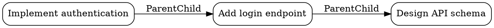

# Episode Relationships - Quick Reference

## Overview

Episode relationships enable modeling connections between tasks, supporting hierarchical organization, dependency tracking, and workflow visualization.

## Relationship Types

| Type | Directional | Acyclic Check | Description |
|------|-------------|---------------|-------------|
| `ParentChild` | ✅ | ✅ | Parent-child hierarchy (epic → story → subtask) |
| `DependsOn` | ✅ | ✅ | Dependency relationship (blocking) |
| `Follows` | ✅ | ❌ | Sequential relationship (predecessor) |
| `RelatedTo` | ❌ | ❌ | Loose association |
| `Blocks` | ✅ | ✅ | Blocking relationship |
| `Duplicates` | ❌ | ❌ | Marks episodes as duplicates |
| `References` | ❌ | ❌ | General cross-reference |

## Core API Methods

### Creating Relationships

```rust
use memory_core::memory::SelfLearningMemory;
use memory_core::episode::{RelationshipType, RelationshipMetadata};

let memory = SelfLearningMemory::new();

// Simple relationship
let metadata = RelationshipMetadata::with_reason("Subtask of parent".to_string());
let rel_id = memory.add_episode_relationship(
    parent_id,
    child_id,
    RelationshipType::ParentChild,
    metadata,
).await?;

// Rich relationship
let metadata = RelationshipMetadata {
    reason: Some("Critical dependency".to_string()),
    created_by: Some("user@example.com".to_string()),
    priority: Some(8),
    custom_fields: {
        let mut map = std::collections::HashMap::new();
        map.insert("project".to_string(), "memory-system".to_string());
        map.insert("ticket".to_string(), "ENG-123".to_string());
        map
    },
};
```

### Querying Relationships

```rust
// Get all relationships for an episode
let relationships = memory.get_episode_relationships(
    episode_id,
    Direction::Both,  // Outgoing, Incoming, or Both
).await?;

// Find related episodes with filters
use memory_core::memory::relationship_query::RelationshipFilter;

let related = memory.find_related_episodes(
    episode_id,
    RelationshipFilter::new()
        .with_type(RelationshipType::DependsOn)
        .with_direction(Direction::Outgoing)
        .with_limit(10)
        .with_min_priority(5),
).await?;

// Get episode with relationships
let with_rels = memory.get_episode_with_relationships(episode_id).await?;
println!("Total relationships: {}", with_rels.total_relationships());

// Check if relationship exists
let exists = memory.relationship_exists(
    from_id,
    to_id,
    RelationshipType::DependsOn,
).await?;
```

### Dependency Queries

```rust
// Get dependencies (episodes this episode depends on)
let deps = memory.get_episode_dependencies(episode_id).await?;

// Get dependents (episodes that depend on this episode)
let dependents = memory.get_episode_dependents(episode_id).await?;
```

### Graph Visualization

```rust
// Build relationship graph
let graph = memory.build_relationship_graph(root_id, max_depth).await?;

// Get statistics
println!("Nodes: {}", graph.node_count());
println!("Edges: {}", graph.edge_count());

// Export to DOT (Graphviz)
let dot = graph.to_dot();
println!("{}", dot);

// Export to JSON
let json = graph.to_json();
println!("{}", json);

// Get relationships for specific episode
let rels = graph.get_relationships_for(episode_id);
```

### Removing Relationships

```rust
memory.remove_episode_relationship(relationship_id).await?;
```

## CLI Usage

### Add Relationship

```bash
memory-cli episode relationship add \
  --from <episode-id> \
  --to <episode-id> \
  --type parent_child \
  --reason "Subtask spawned from parent" \
  --priority 8
```

### Get Relationships

```bash
# Get all relationships
memory-cli episode relationship get <episode-id>

# Get by direction
memory-cli episode relationship get <episode-id> --direction outgoing

# Get by type
memory-cli episode relationship get <episode-id> --type depends_on

# With limit
memory-cli episode relationship get <episode-id> --limit 10
```

### Build Relationship Graph

```bash
# Basic graph
memory-cli episode relationship graph <episode-id>

# With depth limit
memory-cli episode relationship graph <episode-id> --depth 3

# Export to DOT
memory-cli episode relationship graph <episode-id> --format dot > graph.dot

# Render with Graphviz
dot -Tpng graph.dot -o graph.png

# Export to JSON
memory-cli episode relationship graph <episode-id> --format json > graph.json
```

### Find Related Episodes

```bash
# Find all related
memory-cli episode relationship find <episode-id>

# With filters
memory-cli episode relationship find <episode-id> \
  --type depends_on \
  --direction outgoing \
  --limit 5 \
  --min-priority 7
```

### Remove Relationship

```bash
memory-cli episode relationship remove <relationship-id>
```

### Check Relationship Exists

```bash
memory-cli episode relationship exists \
  --from <episode-id> \
  --to <episode-id> \
  --type depends_on
```

## MCP Tools

All relationship operations are available through MCP:

### `memory-mcp_add_episode_relationship`

```json
{
  "from_episode_id": "uuid",
  "to_episode_id": "uuid",
  "relationship_type": "depends_on",
  "reason": "Optional reason",
  "created_by": "Optional creator",
  "priority": 5
}
```

### `memory-mcp_remove_episode_relationship`

```json
{
  "relationship_id": "uuid"
}
```

### `memory-mcp_get_episode_relationships`

```json
{
  "episode_id": "uuid",
  "direction": "both",
  "relationship_type": "depends_on"
}
```

### `memory-mcp_find_related_episodes`

```json
{
  "episode_id": "uuid",
  "relationship_type": "depends_on",
  "direction": "outgoing",
  "limit": 10,
  "min_priority": 5
}
```

### `memory-mcp_add_episode_tags`

```json
{
  "episode_id": "uuid",
  "tags": ["backend", "api", "v2"]
}
```

### `memory-mcp_get_episode_tags`

```json
{
  "episode_id": "uuid"
}
```

### `memory-mcp_search_episodes_by_tags`

```json
{
  "tags": ["backend", "api"],
  "require_all": false,
  "limit": 20
}
```

### `memory-mcp_get_dependency_graph`

```json
{
  "episode_id": "uuid",
  "depth": 3,
  "format": "json"
}
```

## Validation Rules

### Self-Relationship Prevention

```rust
// This will fail
memory.add_episode_relationship(
    episode_id,
    episode_id,  // Same episode
    RelationshipType::DependsOn,
    metadata,
).await?;
// Error: "Episode cannot have a relationship with itself"
```

### Duplicate Detection

```rust
// Add relationship
memory.add_episode_relationship(ep1, ep2, DependsOn, metadata).await?;

// Try to add same relationship again
memory.add_episode_relationship(ep1, ep2, DependsOn, metadata).await?;
// Error: "Relationship already exists"
```

### Cycle Detection

For acyclic relationship types (DependsOn, ParentChild, Blocks):

```rust
// ep1 -> ep2 -> ep3
memory.add_episode_relationship(ep1, ep2, DependsOn, ...).await?;
memory.add_episode_relationship(ep2, ep3, DependsOn, ...).await?;

// Try to create cycle
memory.add_episode_relationship(ep3, ep1, DependsOn, ...).await?;
// Error: "Adding this relationship would create a cycle"
```

## Use Cases

### 1. Task Hierarchy

```rust
// Epic → Story → Subtask
let epic_id = create_episode("Implement authentication").await?;
let story_id = create_episode("Add login endpoint").await?;
let subtask_id = create_episode("Design API schema").await?;

memory.add_episode_relationship(epic_id, story_id, ParentChild, ...).await?;
memory.add_episode_relationship(story_id, subtask_id, ParentChild, ...).await?;
```

### 2. Dependency Tracking

```rust
// API design depends on requirements
let req_id = create_episode("Gather requirements").await?;
let api_id = create_episode("Design API").await?;

memory.add_episode_relationship(api_id, req_id, DependsOn, ...).await?;

// Check if API can start
let deps = memory.get_episode_dependencies(api_id).await?;
if deps.is_empty() {
    println!("API design can start - all dependencies met");
}
```

### 3. Sequential Workflows

```rust
// Design → Implementation → Testing
let design_id = create_episode("Design feature").await?;
let impl_id = create_episode("Implement feature").await?;
let test_id = create_episode("Test feature").await?;

memory.add_episode_relationship(design_id, impl_id, Follows, ...).await?;
memory.add_episode_relationship(impl_id, test_id, Follows, ...).await?;
```

### 4. Blocking Relationships

```rust
// Bug blocks feature release
let bug_id = create_episode("Fix critical bug").await?;
let release_id = create_episode("Release v2.0").await?;

memory.add_episode_relationship(bug_id, release_id, Blocks, ...).await?;

// Find what's blocking the release
let blockers = memory.get_episode_dependents(release_id).await?;
for blocker in blockers {
    println!("Release blocked by: {}", blocker);
}
```

### 5. Cross-References

```rust
// Related documentation
let code_id = create_episode("Implement API").await?;
let docs_id = create_episode("Write API docs").await?;

memory.add_episode_relationship(code_id, docs_id, References, ...).await?;
memory.add_episode_relationship(docs_id, code_id, References, ...).await?;
```

## Graph Visualization

### DOT Format Example



### Render with Graphviz

```bash
# Generate DOT file
memory-cli episode relationship graph <root-id> --format dot > graph.dot

# Render to PNG
dot -Tpng graph.dot -o graph.png

# Render to SVG
dot -Tsvg graph.dot -o graph.svg

# Render to PDF
dot -Tpdf graph.dot -o graph.pdf
```

## Performance Considerations

### Cache-First Querying

Relationship queries use a cache-first strategy:

1. Check redb cache (fast)
2. Fall back to Turso storage (slower)
3. Return results

### Graph Traversal

Graph building uses BFS with configurable depth:

- O(V + E) time complexity
- O(V) space complexity for visited set
- Depth limiting prevents runaway traversal

### Batch Operations

For bulk relationship operations, consider batch processing to reduce round trips.

## Error Handling

### Common Errors

| Error | Cause | Solution |
|-------|-------|----------|
| `EpisodeNotFound` | One or both episodes don't exist | Create episodes first |
| `SelfRelationship` | Episode related to itself | Use different episodes |
| `DuplicateRelationship` | Relationship already exists | Check existence before adding |
| `CycleDetected` | Would create cycle in acyclic graph | Review dependency structure |
| `ValidationError` | Invalid relationship parameters | Check input values |

### Error Example

```rust
match memory.add_episode_relationship(...).await {
    Ok(rel_id) => println!("Created: {}", rel_id),
    Err(e) => {
        if e.to_string().contains("not found") {
            eprintln!("Error: Episode does not exist");
        } else if e.to_string().contains("cycle") {
            eprintln!("Error: This would create a dependency cycle");
        } else {
            eprintln!("Error: {}", e);
        }
    }
}
```

## Best Practices

1. **Use Appropriate Relationship Types**
   - ParentChild for hierarchies
   - DependsOn for blocking dependencies
   - Follows for sequential tasks
   - RelatedTo for loose associations

2. **Add Metadata**
   - Always provide a reason
   - Set priority for important relationships
   - Use custom fields for project-specific data

3. **Query Efficiently**
   - Use direction filters to reduce result set
   - Set limits on large graphs
   - Cache frequently accessed relationships

4. **Validate Before Adding**
   - Check relationship_exists() to avoid duplicates
   - Use find_related_episodes() to understand context

5. **Visualize Complex Graphs**
   - Use DOT export for large graphs
   - Set appropriate depth limits
   - Render with Graphviz for analysis

## See Also

- [Storage Layer](../memory-storage-turso/src/relationships.rs)
- [Memory Layer](../memory-core/src/memory/relationships.rs)
- [Integration Tests](../memory-core/tests/relationship_integration.rs)
- [MCP Tools](../memory-mcp/src/server/tools/episode_relationships.rs)
- [CLI Commands](../memory-cli/src/commands/episode/relationships.rs)
