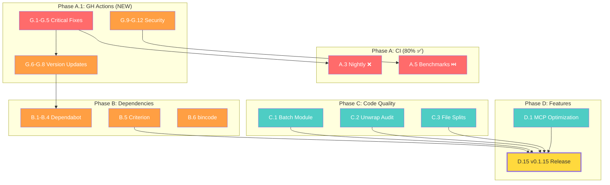

# GOAP Comprehensive Execution Plan - 2026-02-14 (Updated)

**Generated**: 2026-02-14 (Updated from 2026-02-13 plan)
**Previous Plan**: GOAP_EXECUTION_PLAN_2026-02-13_COMPREHENSIVE.md
**Scope**: All remaining tasks, improvements, and enhancements
**Current Version**: v0.1.14 (Cargo.toml + GitHub Release)
**ADR References**: ADR-025 (Project Health), ADR-028 (Features), ADR-029 (GitHub Actions)

---

## Executive Summary

**Progress since 2026-02-13**: Phase A is ~80% complete. CI stabilized (5/7 workflows green), v0.1.14 released, clippy clean. NEW: GitHub Actions audit (ADR-029) identified 17 additional modernization tasks.

**Corrected metrics** (verified 2026-02-14):
- 29 source files >500 LOC (previously claimed "all compliant")
- 651 unwrap/expect in prod code (previously claimed 73)
- 168 `#[allow(dead_code)]` annotations
- 63 `#[ignore]` test annotations
- 1 failing lib test (env-dependent)

**Remaining**: ~56 tasks across 6 phases, ~345 hours (excluding vision items)

| Phase | Status | Tasks | Hours |
|-------|--------|-------|-------|
| Phase A: CI Stabilization | ✅ 80% complete | 2 remaining | ~4h |
| Phase A.1: GH Actions Modernization | 🔴 New | 17 tasks | ~8h |
| Phase B: Dependencies | 🔴 Ready | 6 tasks | ~14h |
| Phase C: Code Quality | 🔴 Scope corrected | 12 tasks | ~90h |
| Phase D: Features | 🔴 Not started | 15 tasks | ~100h |
| Phase E: Vision | 🔵 Future | 9 tasks | ~31 weeks |

---

## Phase A: CI Stabilization (80% COMPLETE)

### Completed ✅

| ID | Task | Status | Date |
|----|------|--------|------|
| A.1 | Fix YAML Lint | ✅ DONE | 2026-02-14 |
| A.2 | Fix Coverage workflow | ✅ DONE | 2026-02-14 |
| A.4 | Fix clippy warnings (Issue #276) | ✅ DONE | 2026-02-14 |
| A.6 | Tag and create GitHub Release v0.1.14 | ✅ DONE | 2026-02-14 |

### Remaining

| ID | Task | Effort | Root Cause |
|----|------|--------|------------|
| A.3 | Fix Nightly Full Tests | 2h | Double checkout bug (lines 58+77) + disk space |
| A.5 | Fix Benchmarks workflow | 2h | Skipped due to dependency on check-quick-check |

**Note**: A.3 is directly fixed by G.4 in Phase A.1 (remove double checkout). A.5 is addressed by G.9 (split benchmark permissions).

---

## Phase A.1: GitHub Actions Modernization (NEW - ADR-029)

**Goal**: Modernize all 9 workflows per 2025-2026 best practices
**Effort**: ~6-8 hours
**Full Plan**: [GOAP_GITHUB_ACTIONS_2026-02-14.md](GOAP_GITHUB_ACTIONS_2026-02-14.md)
**ADR**: [ADR-029](adr/ADR-029-GitHub-Actions-Modernization.md)

### Summary

| Sub-Phase | Priority | Tasks | Effort | Key Items |
|-----------|----------|-------|--------|-----------|
| Critical Fixes | P0 | G.1-G.5 | ~1h | Pin supply-chain risky actions, fix bugs |
| Version Updates | P1 | G.6-G.8 | ~1h | checkout v4→v6, upload-artifact v6 |
| Security Hardening | P1 | G.9-G.12 | ~1.5h | Split benchmark perms, tighten triggers |
| Optimization | P3 | G.13-G.17 | ~3h | Concurrency, Dependabot grouping, templates |

### Cross-Impact with Phase A

- **G.4** (remove double checkout) → fixes **A.3** (Nightly failing)
- **G.9** (split benchmark permissions) → fixes **A.5** (Benchmarks skipped)

---

## Phase B: Dependencies (READY TO START)

**Goal**: All safe dependency updates merged
**Effort**: ~14 hours
**Status**: Dependabot PRs #267-#271 were CLOSED (not merged). Need re-creation.

| ID | Task | Effort | Status |
|----|------|--------|--------|
| B.1 | Re-create sysinfo 0.38.0→0.38.1 PR | 1h | Needs new PR |
| B.2 | Re-create reqwest 0.13.1→0.13.2 PR | 1h | Needs new PR |
| B.3 | Re-create actions/download-artifact 4→7 | 0.5h | Covered by G.6 |
| B.4 | Re-create github/codeql-action 3→4 | 0.5h | Needs new PR |
| B.5 | Criterion 0.5.1→0.8.2 migration (Issue #277) | 6h | Major version change |
| B.6 | Address bincode RUSTSEC advisory | 4h | Evaluate postcard |

### Success Criteria

- [ ] All safe deps merged
- [ ] Criterion migration complete
- [ ] Issue #277 closed

---

## Phase C: Code Quality (CORRECTED SCOPE)

**Goal**: Clean codebase with all modules enabled
**Effort**: ~90 hours (increased from 85h due to corrected metrics)

| ID | Task | Effort | Corrected Scope |
|----|------|--------|-----------------|
| C.1 | Fix disabled batch module | 8h | 4 TODOs in MCP |
| C.2 | Error handling audit | **20h** | **651 unwrap/expect** (was 73) → target ≤100 |
| C.3 | File size violations | **24h** | **29 files >500 LOC** (was "all compliant") |
| C.4 | Dead code audit | 8h | 168 `#[allow(dead_code)]` → target <50 |
| C.5 | Fix CLI batch commands | 4h | Depends on C.1 |
| C.6 | Fix MCP handlers batch TODO | 2h | Depends on C.1 |
| C.7 | Update ROADMAP_ACTIVE.md | 4h | ✅ Partially done 2026-02-14 |
| C.8 | Fix conflicting status claims | 4h | ✅ Partially done 2026-02-14 |
| C.9 | Archive stale plan files | 4h | 117→~30 active files |
| C.10 | Update IMPLEMENTATION_STATUS | 2h | With accurate data |
| C.11 | Fix broken cross-references | 1h | In ROADMAP_V030_VISION |
| C.12 | Create RELEASE_NOTES_v0.1.14.md | 1h | ✅ DONE (release created) |

### Success Criteria

- [ ] Batch module re-enabled or removed
- [ ] ≤100 production unwraps (down from 651)
- [ ] All source files <500 LOC (0 of 29 remaining)
- [ ] Plans directory cleaned

---

## Phase D: Features (UNCHANGED)

**Goal**: Complete all planned features for v0.1.15
**Effort**: ~100 hours

| Sprint | Tasks | Effort |
|--------|-------|--------|
| D.1: MCP Token Optimization | D.1-D.2 | 20h |
| D.2: Storage Optimization | D.3-D.5 | 15h |
| D.3: Remaining Features | D.6-D.10 | 34h |
| D.4: Testing & Validation | D.11-D.15 | 36h |

See [GOAP_EXECUTION_PLAN_2026-02-13_COMPREHENSIVE.md](GOAP_EXECUTION_PLAN_2026-02-13_COMPREHENSIVE.md) for full task breakdown.

---

## Phase E: Vision (UNCHANGED)

See [GOAP_EXECUTION_PLAN_2026-02-13_COMPREHENSIVE.md](GOAP_EXECUTION_PLAN_2026-02-13_COMPREHENSIVE.md) and [ROADMAP_V030_VISION.md](ROADMAPS/ROADMAP_V030_VISION.md).

---

## Updated Full Dependency Graph

---

## Metrics & Tracking

| Phase | Target Date | Tasks | Hours | Status |
|-------|-----------|-------|-------|--------|
| Phase A (remaining) | 2026-02-17 | 2 | ~4h | 🟡 80% Done |
| Phase A.1 (GH Actions) | 2026-02-21 | 17 | ~8h | 🔴 New |
| Phase B | 2026-02-28 | 6 | ~14h | 🔴 Ready |
| Phase C | 2026-03-14 | 12 | ~90h | 🔴 Scope Corrected |
| Phase D | 2026-04-11 | 15 | ~100h | 🔴 Not Started |
| Phase E | Q2-Q4 2026 | 9 | ~31 weeks | 🔵 Vision |

### Priority Distribution

| Priority | Count | Hours |
|----------|-------|-------|
| P0 Critical | 7 (A.3, A.5, G.1-G.5) | ~5h |
| P1 High | 23 | ~55h |
| P2 Medium | 27 | ~155h |
| P3 Low/Vision | 19+ | ~130h+ |

---

## Cross-References

| Document | Relationship |
|----------|-------------|
| plans/adr/ADR-025-Project-Health-Remediation.md | Governing ADR (project health) |
| plans/adr/ADR-028-Feature-Enhancement-Roadmap.md | Feature decisions |
| plans/adr/ADR-029-GitHub-Actions-Modernization.md | GitHub Actions decisions |
| plans/GOAP_GITHUB_ACTIONS_2026-02-14.md | GH Actions detailed plan |
| plans/GOAP_EXECUTION_PLAN_2026-02-13_COMPREHENSIVE.md | Previous plan (superseded) |
| plans/ROADMAPS/ROADMAP_ACTIVE.md | Active development roadmap |
| plans/STATUS/PROJECT_STATUS_UNIFIED.md | Current project status |

---

*Generated by GOAP Agent Analysis on 2026-02-14*
*Supersedes: GOAP_EXECUTION_PLAN_2026-02-13_COMPREHENSIVE.md*
*Next Review: 2026-02-17 (Phase A completion + Phase A.1 critical fixes)*
