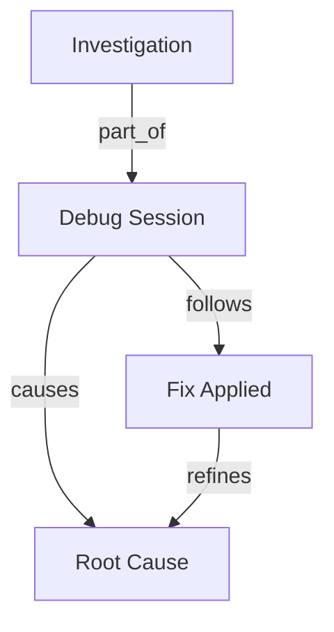
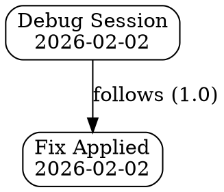

# CLI Episode Relationship Commands - Implementation Plan

**Date**: 2026-02-02  
**Priority**: P0 - Critical  
**Estimated Effort**: 20-30 hours  
**Status**: NOT IMPLEMENTED  

---

## Overview

This plan implements 7 CLI commands for episode relationship management, providing a user-friendly command-line interface to the relationship functionality already available in the storage layer.

**Current Status**: CLI exists but relationship commands are completely missing.

---

## Command Specifications

### 1. `memory-cli relationship add` (4-5 hours)

**Purpose**: Add a relationship between two episodes

**Usage**:
```bash
memory-cli relationship add <FROM_EPISODE_ID> <TO_EPISODE_ID> <TYPE> [OPTIONS]

# Examples:
memory-cli relationship add abc123 def456 follows
memory-cli relationship add abc123 def456 causes --strength 0.8
memory-cli relationship add abc123 def456 related_to --metadata '{"context":"debugging"}'
```

**Arguments**:
- `<FROM_EPISODE_ID>`: Source episode UUID or name
- `<TO_EPISODE_ID>`: Target episode UUID or name  
- `<TYPE>`: Relationship type (follows|causes|part_of|related_to|contradicts|refines)

**Options**:
- `--strength <0.0-1.0>`: Relationship strength (default: 1.0)
- `--metadata <JSON>`: Additional metadata
- `--force`: Skip cycle detection warnings

**Output**:
```
✓ Relationship added successfully
  ID: 789ghi
  From: Episode "Debug Session" (abc123)
  To: Episode "Fix Applied" (def456)
  Type: follows
  Strength: 1.0
  Created: 2026-02-02 12:00:00 UTC
```

**Error Handling**:
- Episode not found → suggest similar names
- Cycle detected → show cycle path and require --force
- Duplicate relationship → show existing relationship

---

### 2. `memory-cli relationship remove` (3-4 hours)

**Purpose**: Remove a relationship by ID or criteria

**Usage**:
```bash
memory-cli relationship remove <RELATIONSHIP_ID>
memory-cli relationship remove --from <EPISODE_ID> --to <EPISODE_ID> --type <TYPE>

# Examples:
memory-cli relationship remove 789ghi
memory-cli relationship remove --from abc123 --to def456 --type follows
memory-cli relationship remove --from abc123 --confirm  # Remove all from episode
```

**Arguments**:
- `<RELATIONSHIP_ID>`: Direct relationship ID

**Options**:
- `--from <EPISODE_ID>`: Source episode filter
- `--to <EPISODE_ID>`: Target episode filter
- `--type <TYPE>`: Relationship type filter
- `--confirm`: Required when removing multiple relationships

**Output**:
```
✓ Relationship removed successfully
  Removed 1 relationship
```

---

### 3. `memory-cli relationship list` (4-5 hours)

**Purpose**: List relationships for episodes

**Usage**:
```bash
memory-cli relationship list <EPISODE_ID> [OPTIONS]
memory-cli relationship list --all [OPTIONS]

# Examples:
memory-cli relationship list abc123
memory-cli relationship list abc123 --direction outgoing
memory-cli relationship list abc123 --type follows --min-strength 0.5
memory-cli relationship list --all --format json
```

**Arguments**:
- `<EPISODE_ID>`: Episode to list relationships for

**Options**:
- `--direction <incoming|outgoing|both>`: Filter by direction (default: both)
- `--type <TYPE>`: Filter by relationship type
- `--min-strength <0.0-1.0>`: Minimum strength threshold
- `--format <table|json|csv>`: Output format (default: table)
- `--all`: List all relationships in system

**Output (table format)**:
```
Episode: "Debug Session" (abc123)

Outgoing Relationships (2):
┌─────────┬──────────────────┬──────────┬──────────┬────────────────────┐
│ ID      │ To Episode       │ Type     │ Strength │ Created            │
├─────────┼──────────────────┼──────────┼──────────┼────────────────────┤
│ 789ghi  │ Fix Applied      │ follows  │ 1.0      │ 2026-02-02 12:00   │
│ 456jkl  │ Root Cause       │ causes   │ 0.9      │ 2026-02-02 11:30   │
└─────────┴──────────────────┴──────────┴──────────┴────────────────────┘

Incoming Relationships (1):
┌─────────┬──────────────────┬──────────┬──────────┬────────────────────┐
│ ID      │ From Episode     │ Type     │ Strength │ Created            │
├─────────┼──────────────────┼──────────┼──────────┼────────────────────┤
│ 321mno  │ Investigation    │ part_of  │ 1.0      │ 2026-02-02 11:00   │
└─────────┴──────────────────┴──────────┴──────────┴────────────────────┘

Total: 3 relationships
```

---

### 4. `memory-cli relationship graph` (6-8 hours)

**Purpose**: Visualize dependency graph

**Usage**:
```bash
memory-cli relationship graph [EPISODE_IDS...] [OPTIONS]

# Examples:
memory-cli relationship graph abc123 def456
memory-cli relationship graph --all --format mermaid
memory-cli relationship graph --type follows --output graph.dot
memory-cli relationship graph --max-nodes 50 --open
```

**Arguments**:
- `[EPISODE_IDS...]`: Episodes to include (optional, default: all)

**Options**:
- `--format <graphviz|mermaid|json>`: Output format (default: graphviz)
- `--type <TYPE>`: Filter by relationship type
- `--max-nodes <N>`: Maximum nodes to include (default: 100)
- `--output <FILE>`: Save to file
- `--open`: Open in default viewer (requires graphviz or mermaid-cli)
- `--layout <dot|neato|fdp|circo>`: GraphViz layout engine

**Output (Mermaid format)**:


**Output (GraphViz format)**:


**Interactive Features**:
- Color code by relationship type
- Node size by episode importance (step count)
- Edge thickness by strength

---

### 5. `memory-cli relationship find` (4-5 hours)

**Purpose**: Find related episodes (transitive search)

**Usage**:
```bash
memory-cli relationship find <EPISODE_ID> [OPTIONS]

# Examples:
memory-cli relationship find abc123
memory-cli relationship find abc123 --max-depth 3 --min-strength 0.5
memory-cli relationship find abc123 --type follows --format json
```

**Arguments**:
- `<EPISODE_ID>`: Starting episode

**Options**:
- `--max-depth <N>`: Maximum hops (default: 2, max: 5)
- `--type <TYPE>`: Filter by relationship type
- `--min-strength <0.0-1.0>`: Minimum cumulative strength (default: 0.5)
- `--format <table|tree|json>`: Output format

**Output (tree format)**:
```
Related Episodes for "Debug Session" (abc123):

├─ [1 hop] Fix Applied (def456) - follows - strength: 1.0
│  └─ [2 hops] Verification (789ghi) - follows - strength: 0.8
│
├─ [1 hop] Root Cause (456jkl) - causes - strength: 0.9
│  ├─ [2 hops] Analysis (321mno) - part_of - strength: 0.9
│  └─ [2 hops] Similar Bug (654pqr) - related_to - strength: 0.45
│
└─ [1 hop] Investigation (321mno) - related_to - strength: 0.7

Found 6 related episodes across 2 hops
```

---

### 6. `memory-cli relationship validate` (3-4 hours)

**Purpose**: Validate relationships and check for cycles

**Usage**:
```bash
memory-cli relationship validate [OPTIONS]

# Examples:
memory-cli relationship validate
memory-cli relationship validate --type follows
memory-cli relationship validate --check-add abc123 def456 follows
```

**Options**:
- `--type <TYPE>`: Validate specific relationship type only
- `--check-add <FROM> <TO> <TYPE>`: Check if adding would create cycle
- `--fix`: Automatically remove cycles (dangerous!)

**Output (no cycles)**:
```
✓ Validation complete
  Total relationships: 42
  Types checked: follows, causes
  No cycles detected
  All relationships valid
```

**Output (cycles detected)**:
```
✗ Validation failed - Cycles detected

Cycle 1 (follows):
  Episode A (abc123) → Episode B (def456) → Episode C (789ghi) → Episode A (abc123)
  
Cycle 2 (causes):
  Episode X (111aaa) → Episode Y (222bbb) → Episode X (111aaa)

Total: 2 cycles found in 42 relationships

Suggestions:
  • Review and remove circular dependencies
  • Use --fix to automatically break cycles (removes weakest relationship)
  • Run: memory-cli relationship remove <ID>
```

---

### 7. `memory-cli relationship info` (2-3 hours)

**Purpose**: Get detailed information about a relationship

**Usage**:
```bash
memory-cli relationship info <RELATIONSHIP_ID>

# Example:
memory-cli relationship info 789ghi
```

**Arguments**:
- `<RELATIONSHIP_ID>`: Relationship ID

**Output**:
```
Relationship: 789ghi

From Episode:
  ID: abc123
  Name: Debug Session
  Created: 2026-02-02 11:00:00 UTC
  Status: completed
  Steps: 12

To Episode:
  ID: def456
  Name: Fix Applied
  Created: 2026-02-02 12:00:00 UTC
  Status: completed
  Steps: 8

Relationship Details:
  Type: follows
  Strength: 1.0
  Created: 2026-02-02 12:00:00 UTC
  Metadata: {"context": "debugging", "confidence": "high"}

Validation:
  ✓ Both episodes exist
  ✓ No cycle detected
  ✓ Valid relationship type
```

---

## Implementation Structure

### File Organization

```
memory-cli/src/commands/
├── relationship.rs           (NEW - main relationship command handler)
├── relationship/              (NEW - submodule)
│   ├── mod.rs                (exports)
│   ├── add.rs                (add command)
│   ├── remove.rs             (remove command)
│   ├── list.rs               (list command)
│   ├── graph.rs              (graph visualization)
│   ├── find.rs               (transitive search)
│   ├── validate.rs           (cycle detection)
│   └── info.rs               (detailed info)
└── mod.rs                    (add relationship module)
```

### Integration Points

**File**: `memory-cli/src/commands/mod.rs`

Add:
```rust
pub mod relationship;

pub enum Command {
    // ... existing commands ...
    Relationship(relationship::RelationshipCommand),
}
```

**File**: `memory-cli/src/main.rs`

Add to CLI parser:
```rust
#[derive(Debug, Subcommand)]
pub enum Commands {
    // ... existing commands ...
    /// Manage episode relationships
    Relationship(RelationshipArgs),
}
```

---

## Dependencies

### New Crate Dependencies (Cargo.toml)

```toml
# For graph visualization
petgraph = "0.6"              # Graph algorithms
graphviz-rust = "0.6"         # GraphViz generation
mermaid-rust = "0.1"          # Mermaid generation (or manual formatting)

# For table rendering (may already exist)
comfy-table = "7.0"           # Already used in CLI
```

### Storage Layer

Uses existing:
- `EpisodicStorage::add_relationship()`
- `EpisodicStorage::remove_relationship()`
- `EpisodicStorage::get_relationships()`

---

## Testing Strategy

### Unit Tests (per command)
- Valid input → success
- Invalid episode ID → helpful error
- Missing required args → usage help
- Output formatting correctness

### Integration Tests
```rust
#[test]
fn test_relationship_workflow() {
    // 1. Create two episodes
    // 2. Add relationship via CLI
    // 3. List relationships
    // 4. Validate output
    // 5. Remove relationship
}
```

### Manual Testing
- Test with 100+ relationships
- Test graph visualization with complex graph
- Test cycle detection with known cycles
- Test output formats (JSON, table, GraphViz)

---

## Implementation Phases

### Phase 1: Core Commands (Days 1-2)
**Effort**: 10-12 hours

1. Implement `relationship add` (4-5h)
2. Implement `relationship remove` (3-4h)
3. Implement `relationship list` (4-5h)
4. Basic unit tests (2h)

**Deliverable**: Basic CRUD via CLI

---

### Phase 2: Query Commands (Days 3-4)
**Effort**: 7-9 hours

1. Implement `relationship find` (4-5h)
2. Implement `relationship info` (2-3h)
3. Unit tests (2h)

**Deliverable**: Querying and search working

---

### Phase 3: Advanced Commands (Days 5-6)
**Effort**: 9-12 hours

1. Implement `relationship graph` (6-8h)
2. Implement `relationship validate` (3-4h)

**Deliverable**: Visualization and validation complete

---

### Phase 4: Polish & Testing (Day 7)
**Effort**: 4-6 hours

1. Integration tests (2-3h)
2. Documentation and examples (1-2h)
3. Error message improvements (1h)

**Deliverable**: Production-ready CLI

---

## Success Criteria

- [ ] All 7 commands implemented and tested
- [ ] Help text and examples for each command
- [ ] Consistent output formatting
- [ ] Helpful error messages with suggestions
- [ ] Graph visualization working (GraphViz + Mermaid)
- [ ] Integration tests pass
- [ ] Documentation in CLI_USER_GUIDE.md

---

## User Experience Features

### Auto-Completion
Support shell auto-completion for:
- Episode IDs (suggest recent episodes)
- Relationship types (enum values)
- Format options

### Interactive Mode
For commands that might remove multiple relationships:
```bash
$ memory-cli relationship remove --from abc123 --confirm
⚠ This will remove 5 relationships. Continue? [y/N]: y
```

### Progress Indicators
For long-running operations:
```bash
$ memory-cli relationship graph --all
⣾ Fetching episodes... (42/100)
⣷ Building graph...
✓ Graph generated successfully
```

---

## Next Steps

1. Review and approve this plan
2. Create feature branch: `feat/cli-relationship-commands`
3. Start with Phase 1 (core commands)
4. Daily progress updates in plans folder

---

**Total Effort**: 20-30 hours (3-4 business days)  
**Priority**: P0 - Required for user-facing CLI  
**Dependencies**: MCP relationship tools (can develop in parallel)
