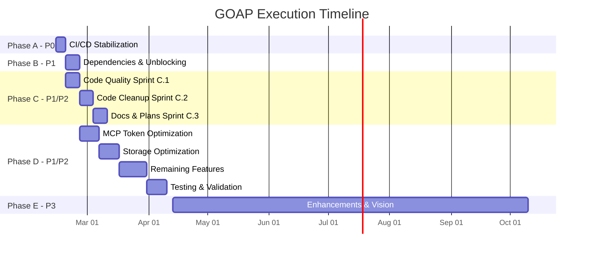
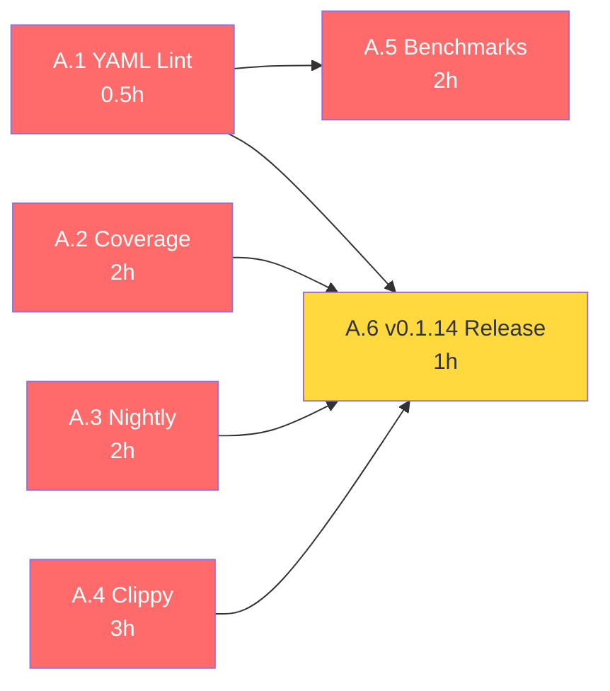
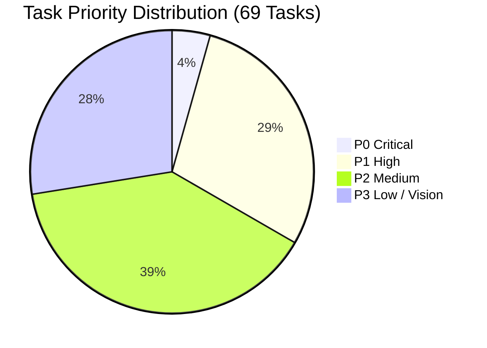
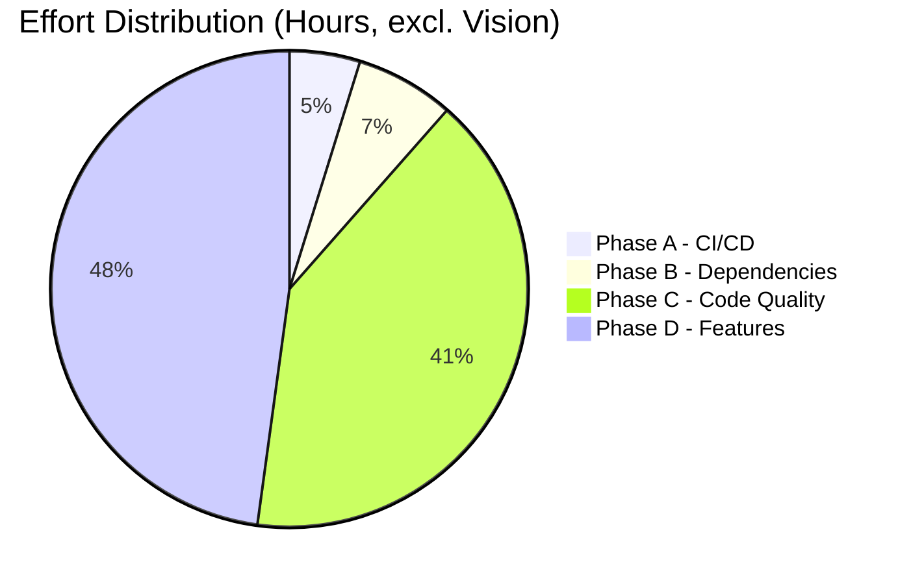

# GOAP Comprehensive Execution Plan - 2026-02-13

**Generated**: 2026-02-13 via GOAP Agent Analysis
**Scope**: All missing tasks, improvements, and enhancements for rust-self-learning-memory
**Current Version**: v0.1.14 (Cargo.toml) | v0.1.13 (Latest GitHub Release)
**ADR Reference**: ADR-025 (Project Health Remediation)

---

## Executive Summary

69 identified tasks across 10 categories, ~338 hours of work (excluding vision items).
- 3 P0 Critical (CI stabilization)
- 20 P1 High Priority (unblock development)
- 27 P2 Medium Priority (quality & features)
- 19 P3 Low Priority (enhancements & vision)

### High-Level Phase Overview

---

## Phase A: CI/CD Stabilization (P0 - Week 1)

**Goal**: All CI workflows green on main branch
**Effort**: ~10 hours
**Blocks**: Everything else (can't merge PRs with red CI)

### Tasks

| ID | Task | Effort | Dependency | Owner |
|----|------|--------|------------|-------|
| A.1 | Fix YAML Lint: trailing spaces in benchmarks.yml | 0.5h | None | - |
| A.2 | Fix Coverage workflow: add disk space maximization, exclude benches | 2h | None | - |
| A.3 | Fix Nightly Full Tests: disk space + double checkout | 2h | None | - |
| A.4 | Fix clippy warnings on main branch (Issue #276) | 3h | None | - |
| A.5 | Fix Benchmarks workflow concurrency/timeout | 2h | A.1 | - |
| A.6 | Tag and create GitHub Release v0.1.14 | 1h | A.1-A.4 | - |

### Phase A Dependency Graph

### Success Criteria

- [ ] All 8 CI workflows passing on main
- [ ] v0.1.14 GitHub release published
- [ ] Dependabot PRs unblocked

---

## Phase B: Dependencies & Unblocking (P1 - Week 1-2)

**Goal**: All safe dependency updates merged
**Effort**: ~14 hours
**Blocks**: Phase C testing

### Tasks

| ID | Task | Effort | Dependency | Owner |
|----|------|--------|------------|-------|
| B.1 | Re-open and merge sysinfo 0.38.0→0.38.1 | 1h | A.4 | - |
| B.2 | Re-open and merge reqwest 0.13.1→0.13.2 | 1h | A.4 | - |
| B.3 | Re-open and merge actions/download-artifact 4→7 | 0.5h | A.4 | - |
| B.4 | Re-open and merge github/codeql-action 3→4 | 0.5h | A.4 | - |
| B.5 | Criterion 0.5.1→0.8.2 migration (Issue #277) | 6h | A.5 | - |
| B.6 | Address bincode RUSTSEC-2025-0141 advisory | 4h | None | - |

### Phase B Dependency Graph

```mermaid
graph LR
    A4[A.4 Clippy ✅] --> B1[B.1 sysinfo<br/>1h]
    A4 --> B2[B.2 reqwest<br/>1h]
    A4 --> B3[B.3 download-artifact<br/>0.5h]
    A4 --> B4[B.4 codeql-action<br/>0.5h]
    A5[A.5 Benchmarks ✅] --> B5[B.5 Criterion<br/>6h]
    B6[B.6 bincode advisory<br/>4h]

    style B1 fill:#4ecdc4,color:#fff
    style B2 fill:#4ecdc4,color:#fff
    style B3 fill:#4ecdc4,color:#fff
    style B4 fill:#4ecdc4,color:#fff
    style B5 fill:#4ecdc4,color:#fff
    style B6 fill:#4ecdc4,color:#fff
```

### Success Criteria

- [ ] All 4 Dependabot PRs re-opened and merged
- [ ] Criterion migration complete with benchmarks running
- [ ] bincode advisory resolved (migrate to postcard or pin)

---

## Phase C: Code Quality & Technical Debt (P1-P2 - Weeks 2-4)

**Goal**: Clean codebase with all modules enabled
**Effort**: ~85 hours

### Sprint C.1: Critical Code Quality (Week 2)

| ID | Task | Effort | Dependency | Owner |
|----|------|--------|------------|-------|
| C.1 | Fix disabled batch module (re-enable or remove) | 8h | None | - |
| C.2 | Error handling audit: convert 73 production unwraps | 16h | None | - |
| C.3 | Fix file size violations (30 files >500 LOC) | 20h | None | - |

### Sprint C.2: Code Cleanup (Week 3)

| ID | Task | Effort | Dependency | Owner |
|----|------|--------|------------|-------|
| C.4 | Remove dead code / audit 171 `#[allow(dead_code)]` | 8h | None | - |
| C.5 | Fix CLI batch commands workaround | 4h | C.1 | - |
| C.6 | Fix MCP handlers batch TODO | 2h | C.1 | - |

### Sprint C.3: Documentation & Plans Cleanup (Week 3-4)

| ID | Task | Effort | Dependency | Owner |
|----|------|--------|------------|-------|
| C.7 | Update ROADMAP_ACTIVE.md to reflect current state | 4h | None | - |
| C.8 | Fix conflicting status claims in PROJECT_STATUS | 4h | None | - |
| C.9 | Archive stale plan files (117→~30 active) | 4h | None | - |
| C.10 | Update IMPLEMENTATION_STATUS with accurate data | 2h | C.3 | - |
| C.11 | Fix broken cross-references in ROADMAP_V030_VISION | 1h | None | - |
| C.12 | Create RELEASE_NOTES_v0.1.14.md | 1h | A.6 | - |

### Phase C Dependency Graph

```mermaid
graph TD
    C1[C.1 Batch Module<br/>8h] --> C5[C.5 CLI Batch<br/>4h]
    C1 --> C6[C.6 MCP Handlers<br/>2h]
    C3[C.3 File Splits<br/>20h] --> C10[C.10 Update Status<br/>2h]
    A6[A.6 v0.1.14 Release ✅] --> C12[C.12 Release Notes<br/>1h]

    C2[C.2 Unwrap Audit<br/>16h]
    C4[C.4 Dead Code<br/>8h]
    C7[C.7 ROADMAP Update<br/>4h]
    C8[C.8 Status Claims<br/>4h]
    C9[C.9 Archive Plans<br/>4h]
    C11[C.11 Cross-refs<br/>1h]

    style C1 fill:#ff9f43,color:#fff
    style C2 fill:#ff9f43,color:#fff
    style C3 fill:#ff9f43,color:#fff
    style C4 fill:#a29bfe,color:#fff
    style C5 fill:#a29bfe,color:#fff
    style C6 fill:#a29bfe,color:#fff
    style C7 fill:#74b9ff,color:#fff
    style C8 fill:#74b9ff,color:#fff
    style C9 fill:#74b9ff,color:#fff
    style C10 fill:#74b9ff,color:#fff
    style C11 fill:#74b9ff,color:#fff
    style C12 fill:#74b9ff,color:#fff
```

### Success Criteria

- [ ] Batch module re-enabled or cleanly removed
- [ ] ≤50 production unwraps remaining (down from 73)
- [ ] All source files <500 LOC
- [ ] Plans directory reduced to ~30 active files
- [ ] RELEASE_NOTES_v0.1.14.md published

---

## Phase D: Feature Completion (P1-P2 - Weeks 4-8)

**Goal**: Complete all planned features for v0.1.15
**Effort**: ~100 hours

### Sprint D.1: MCP Token Optimization (Week 4-5)

| ID | Task | Effort | Dependency | Owner |
|----|------|--------|------------|-------|
| D.1 | MCP Dynamic Tool Loading (90-96% input reduction) | 12h | None | - |
| D.2 | MCP Field Selection/Projection (20-60% output) | 8h | None | - |

### Sprint D.2: Storage Optimization Completion (Week 5-6)

| ID | Task | Effort | Dependency | Owner |
|----|------|--------|------------|-------|
| D.3 | Adaptive TTL integration (Phase 2 completion) | 8h | None | - |
| D.4 | Enable Zstd compression by default | 3h | None | - |
| D.5 | Wire transport compression to storage operations | 4h | D.4 | - |

### Sprint D.3: Remaining Features (Week 6-8)

| ID | Task | Effort | Dependency | Owner |
|----|------|--------|------------|-------|
| D.6 | Embeddings integration remaining 15% | 10h | None | - |
| D.7 | Turso batch writes | 4h | C.1 | - |
| D.8 | redb batch writes | 4h | C.1 | - |
| D.9 | redb read-through cache | 4h | None | - |
| D.10 | Configuration wizard UX polish (33% remaining) | 12h | None | - |

### Sprint D.4: Testing & Validation (Week 7-8)

| ID | Task | Effort | Dependency | Owner |
|----|------|--------|------------|-------|
| D.11 | Fix/redesign 30 ignored tests | 16h | None | - |
| D.12 | Fix WASM sandbox tests | 6h | None | - |
| D.13 | Fix flaky MCP sandbox tests | 4h | None | - |
| D.14 | Advanced pattern algorithm testing | 8h | None | - |
| D.15 | Create v0.1.15 GitHub Release | 2h | D.1-D.14 | - |

### Phase D Dependency Graph

```mermaid
graph TD
    subgraph "Sprint D.1 - MCP"
        D1[D.1 Dynamic Loading<br/>12h]
        D2[D.2 Field Projection<br/>8h]
    end

    subgraph "Sprint D.2 - Storage"
        D3[D.3 Adaptive TTL<br/>8h]
        D4[D.4 Zstd Enable<br/>3h] --> D5[D.5 Transport Wire<br/>4h]
    end

    subgraph "Sprint D.3 - Features"
        D6[D.6 Embeddings<br/>10h]
        C1[C.1 Batch ✅] --> D7[D.7 Turso Batch<br/>4h]
        C1 --> D8[D.8 redb Batch<br/>4h]
        D9[D.9 Read-through Cache<br/>4h]
        D10[D.10 Config Wizard<br/>12h]
    end

    subgraph "Sprint D.4 - Testing"
        D11[D.11 Ignored Tests<br/>16h]
        D12[D.12 WASM Tests<br/>6h]
        D13[D.13 MCP Tests<br/>4h]
        D14[D.14 Pattern Tests<br/>8h]
    end

    D1 --> D15[D.15 v0.1.15 Release<br/>2h]
    D2 --> D15
    D3 --> D15
    D5 --> D15
    D6 --> D15
    D7 --> D15
    D8 --> D15
    D9 --> D15
    D10 --> D15
    D11 --> D15
    D12 --> D15
    D13 --> D15
    D14 --> D15

    style D15 fill:#ffd93d,color:#333
    style D1 fill:#6c5ce7,color:#fff
    style D2 fill:#6c5ce7,color:#fff
    style D3 fill:#00b894,color:#fff
    style D4 fill:#00b894,color:#fff
    style D5 fill:#00b894,color:#fff
    style D7 fill:#fdcb6e,color:#333
    style D8 fill:#fdcb6e,color:#333
```

---

## Phase E: Enhancements & Vision (P3 - Q2-Q4 2026)

**Goal**: Advanced capabilities
**Effort**: ~31 weeks (vision-level items)

| ID | Task | Effort | Dependency | Owner |
|----|------|--------|------------|-------|
| E.1 | Distributed Memory Synchronization | 6 weeks | Phase D | - |
| E.2 | A/B Testing Framework | 3 weeks | Phase D | - |
| E.3 | Advanced Observability (Prometheus/OpenTelemetry) | 4 weeks | Phase D | - |
| E.4 | Real-Time Pattern Learning | 8 weeks | Phase D | - |
| E.5 | Custom Embedding Models (ONNX/PyTorch) | 10 weeks | Phase D | - |
| E.6 | Multi-Tenancy & RBAC | 6 weeks | Phase D | - |
| E.7 | Binary size reduction (2.1GB→<1.5GB) | 8h | B.5 | - |
| E.8 | Developer getting-started guide | 4h | Phase C | - |
| E.9 | Large-scale validation (10K+ episodes) | 20h | Phase D | - |

### Phase E Vision Roadmap

```mermaid
graph LR
    PD[Phase D Complete ✅] --> E1[E.1 Distributed Sync<br/>6 weeks]
    PD --> E2[E.2 A/B Testing<br/>3 weeks]
    PD --> E3[E.3 Observability<br/>4 weeks]
    PD --> E4[E.4 Real-Time Learning<br/>8 weeks]
    PD --> E5[E.5 Custom Embeddings<br/>10 weeks]
    PD --> E6[E.6 Multi-Tenancy<br/>6 weeks]
    B5[B.5 Criterion ✅] --> E7[E.7 Binary Size<br/>8h]
    PC[Phase C Complete ✅] --> E8[E.8 Dev Guide<br/>4h]
    PD --> E9[E.9 Scale Validation<br/>20h]

    style E1 fill:#dfe6e9,color:#333
    style E2 fill:#dfe6e9,color:#333
    style E3 fill:#dfe6e9,color:#333
    style E4 fill:#dfe6e9,color:#333
    style E5 fill:#dfe6e9,color:#333
    style E6 fill:#dfe6e9,color:#333
    style E7 fill:#b2bec3,color:#333
    style E8 fill:#b2bec3,color:#333
    style E9 fill:#b2bec3,color:#333
```

---

## Full Dependency Graph

```mermaid
graph TD
    %% Phase A - CI/CD Stabilization
    A1[A.1 YAML Lint] --> A5[A.5 Benchmarks]
    A1 --> A6[A.6 v0.1.14 Release]
    A2[A.2 Coverage] --> A6
    A3[A.3 Nightly] --> A6
    A4[A.4 Clippy] --> A6
    A4 --> B1[B.1 sysinfo]
    A4 --> B2[B.2 reqwest]
    A4 --> B3[B.3 download-artifact]
    A4 --> B4[B.4 codeql-action]
    A5 --> B5[B.5 Criterion Migration]

    %% Phase B → Phase C
    C1[C.1 Batch Module] --> C5[C.5 CLI Batch]
    C1 --> C6[C.6 MCP Handlers]
    C1 --> D7[D.7 Turso Batch]
    C1 --> D8[D.8 redb Batch]
    C3[C.3 File Splits] --> C10[C.10 Update Status]
    A6 --> C12[C.12 Release Notes]

    %% Phase D
    D4[D.4 Zstd] --> D5[D.5 Transport Wire]
    D1[D.1 MCP Dynamic Loading] --> D15[D.15 v0.1.15]
    D2[D.2 Field Projection] --> D15
    D3[D.3 Adaptive TTL] --> D15
    D5 --> D15
    D6[D.6 Embeddings] --> D15
    D7 --> D15
    D8 --> D15
    D9[D.9 Read-through Cache] --> D15
    D10[D.10 Config Wizard] --> D15
    D11[D.11 Ignored Tests] --> D15
    D12[D.12 WASM Tests] --> D15
    D13[D.13 MCP Tests] --> D15
    D14[D.14 Pattern Tests] --> D15

    %% Phase E
    B5 --> E7[E.7 Binary Size]
    D15 --> E1[E.1 Distributed Sync]
    D15 --> E4[E.4 Real-Time Learning]
    D15 --> E9[E.9 Scale Validation]

    %% Styling
    classDef p0 fill:#ff6b6b,color:#fff,stroke:#c0392b
    classDef p1 fill:#ff9f43,color:#fff,stroke:#e67e22
    classDef p2 fill:#4ecdc4,color:#fff,stroke:#16a085
    classDef p3 fill:#dfe6e9,color:#333,stroke:#b2bec3
    classDef milestone fill:#ffd93d,color:#333,stroke:#f39c12,stroke-width:3px

    class A1,A2,A3,A4,A5 p0
    class A6,D15 milestone
    class B1,B2,B3,B4,B5,B6,C1,C2,C3 p1
    class C4,C5,C6,C7,C8,C9,C10,C11,C12,D1,D2,D3,D4,D5,D6,D7,D8,D9,D10,D11,D12,D13,D14 p2
    class E1,E4,E7,E9 p3
```

---

## Metrics & Tracking

### Phase Completion Targets

| Phase | Target Date | Tasks | Hours | Status |
|-------|------------|-------|-------|--------|
| Phase A | 2026-02-17 | 6 | ~10h | 🔴 Not Started |
| Phase B | 2026-02-24 | 6 | ~14h | 🔴 Not Started |
| Phase C | 2026-03-10 | 12 | ~85h | 🔴 Not Started |
| Phase D | 2026-04-07 | 15 | ~100h | 🔴 Not Started |
| Phase E | Q2-Q4 2026 | 9 | ~31 weeks | 🔵 Vision |

### Priority Distribution

### Effort Distribution by Phase

### Quality Gates per Phase

| Phase | Gate Criteria | Verification |
|-------|--------------|--------------|
| **Phase A** | All CI workflows green, v0.1.14 released | `gh workflow list --repo d-o-hub/rust-self-learning-memory` |
| **Phase B** | All safe deps merged, 0 open Dependabot PRs | `gh pr list --label dependencies` |
| **Phase C** | 0 disabled modules, ≤50 unwraps, all files <500 LOC, plans cleaned | `./scripts/quality-gates.sh` |
| **Phase D** | MCP optimization live, Phase 2 complete, v0.1.15 released | `cargo test --all` + manual verification |
| **Phase E** | Per-feature acceptance criteria | Feature-specific validation |

---

## Risk Register

| Risk | Impact | Probability | Mitigation |
|------|--------|-------------|------------|
| Criterion 0.8.2 API breaking changes | Medium | High | Budget 6h, review changelog first |
| bincode advisory requires full migration | High | Medium | Evaluate postcard as drop-in replacement |
| Batch module re-enable causes regressions | High | Medium | Feature-flag behind `batch` feature gate |
| Disk space limits on CI runners | High | High | Use `jlumbroso/free-disk-space` action |
| 30 ignored tests have stale assumptions | Medium | High | Triage first, delete tests with invalid assumptions |
| Phase D scope creep from feature requests | High | Medium | Strict scope freeze after planning |

---

## Parallel Execution Opportunities

Tasks within the same phase that have **no mutual dependencies** can be executed in parallel:

### Phase A Parallel Groups

- **Group 1** (no deps): A.1, A.2, A.3, A.4
- **Group 2** (after A.1): A.5
- **Group 3** (after A.1-A.4): A.6

### Phase B Parallel Groups

- **Group 1** (after A.4): B.1, B.2, B.3, B.4
- **Group 2** (after A.5): B.5
- **Independent**: B.6

### Phase C Parallel Groups

- **Group 1** (no deps): C.1, C.2, C.3, C.4, C.7, C.8, C.9, C.11
- **Group 2** (after C.1): C.5, C.6
- **Group 3** (after C.3): C.10
- **Group 4** (after A.6): C.12

### Phase D Parallel Groups

- **Group 1** (no deps): D.1, D.2, D.3, D.4, D.6, D.9, D.10, D.11, D.12, D.13, D.14
- **Group 2** (after D.4): D.5
- **Group 3** (after C.1): D.7, D.8
- **Group 4** (after all): D.15

---

## Cross-Reference Index

| Document | Relationship |
|----------|-------------|
| `plans/adr/ADR-025-Project-Health-Remediation.md` | Governing ADR for this plan |
| `plans/CI_CD_ISSUES_ANALYSIS_2026-02-13.md` | Phase A task source |
| `plans/DEPENDABOT_TRIAGE_REPORT_2026-02-13.md` | Phase B task source |
| `plans/COMPREHENSIVE_MISSING_IMPLEMENTATION_ANALYSIS_2026-01-31.md` | Phase C/D task source |
| `plans/MCP_OPTIMIZATION_IMPLEMENTATION_ROADMAP.md` | Sprint D.1 details |
| `plans/PHASE2_STORAGE_OPTIMIZATION_EXECUTION_PLAN.md` | Sprint D.2 details |
| `plans/ROADMAPS/` | Phase E vision alignment |
| `plans/STATUS/` | Current implementation status |
| `CHANGELOG.md` | Release history |

---

*Generated by GOAP Agent Analysis on 2026-02-13*
*ADR Reference: plans/adr/ADR-025-Project-Health-Remediation.md*
*Next Review: 2026-02-17 (Phase A completion checkpoint)*
