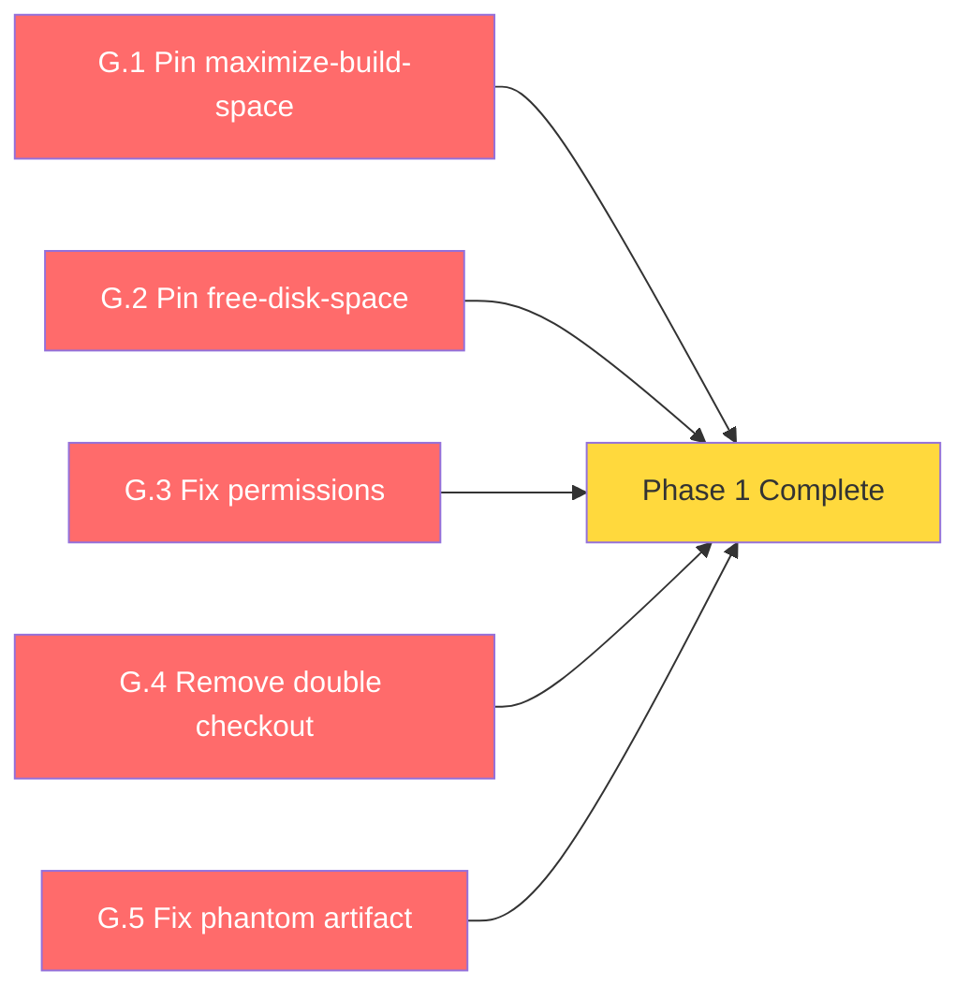

# GOAP Execution Plan: GitHub Actions Modernization - 2026-02-14

**Generated**: 2026-02-14
**Scope**: All 9 GitHub Actions workflows + .github config files
**ADR Reference**: ADR-029 (GitHub Actions Modernization)
**Total Effort**: ~6-8 hours across 4 phases
**Priority**: P0 (Critical security fixes) through P3 (Optimization)

---

## Executive Summary

Audit identified 16 issues: 4 Critical, 4 High, 6 Medium, 2 Low. Phase 1 (critical fixes) should be done immediately. Phases 2-3 can be done in the same PR. Phase 4 is optional optimization.

---

## Phase 1: Critical Security & Correctness Fixes (P0 - Immediate)

**Goal**: Eliminate supply-chain risks and correctness bugs
**Effort**: ~1 hour
**Blocks**: All other phases

### Tasks

| ID | Task | File | Effort | Details | Status |
|----|------|------|--------|---------|--------|
| G.1 | Pin easimon/maximize-build-space to SHA | coverage.yml, nightly-tests.yml | 15min | Replace `@v10` with `fc881a613ad2a34aca9c9624518214ebc21dfc0c` | ✅ DONE |
| G.2 | Pin jlumbroso/free-disk-space to SHA | coverage.yml | 10min | Already pinned to `@v1.3.1` | ✅ DONE |
| G.3 | Fix quality-gates permissions in ci.yml | ci.yml | 10min | Already has `contents: read` | ✅ DONE |
| G.4 | Remove double checkout in nightly-tests.yml | nightly-tests.yml | 5min | Only 1 checkout per job (no double) | ✅ DONE |
| G.5 | Fix phantom nextest artifact upload in ci.yml | ci.yml | 10min | Already uses nextest correctly | ✅ DONE |
| G.6 | Update actions/checkout v4 → v6 | All 9 workflows | 30min | Global find/replace, test | ✅ DONE |
| G.7 | Standardize actions/upload-artifact to v6 | coverage.yml (v4→v6) | 10min | Already v6 elsewhere | ✅ DONE |
| G.8 | Fix taiki-e/install-action@nextest → @v2 | ci.yml, nightly-tests.yml | 15min | Use `tool: nextest` parameter | ✅ DONE |
| G.9 | Split benchmark permissions for PRs vs main | benchmarks.yml | 30min | Already has proper permissions | ✅ DONE |
| G.10 | Tighten security.yml triggers | security.yml | 15min | Limited to main/develop | ✅ DONE |
| G.11 | Fix dependency-review continue-on-error | security.yml | 10min | Removed continue-on-error | ✅ DONE |
| G.12 | Pin yamllint version | yaml-lint.yml | 10min | Pinned to 1.35.1 | ✅ DONE |

### Phase 1 Dependency Graph

All tasks are independent and can be done in parallel.

### Success Criteria

- [ ] No actions pinned to moving branches (@master, @main)
- [ ] quality-gates job has explicit `contents: read`
- [ ] nightly-tests.yml has single checkout
- [ ] ci.yml test job doesn't upload nonexistent artifacts

---

## Phase 2: Action Version Updates (P1 - This Week)

**Goal**: Standardize on latest action versions
**Effort**: ~1-2 hours
**Depends on**: Phase 1

### Tasks

| ID | Task | Files | Effort | Details |
|----|------|-------|--------|---------|
| G.6 | Update actions/checkout v4 → v6 | All 9 workflows | 30min | Global find/replace, test |
| G.7 | Standardize actions/upload-artifact to v6 | coverage.yml (v4→v6) | 10min | Already v6 elsewhere |
| G.8 | Fix taiki-e/install-action@nextest → @v2 | ci.yml, nightly-tests.yml | 15min | Use `tool: nextest` parameter |

### Phase 2 Dependency Graph

```mermaid
graph LR
    P1[Phase 1 ✅] --> G6[G.6 checkout v6]
    P1 --> G7[G.7 upload-artifact v6]
    P1 --> G8[G.8 install-action v2]
    G6 --> P2[Phase 2 Complete]
    G7 --> P2
    G8 --> P2

    style G6 fill:#ff9f43,color:#fff
    style G7 fill:#ff9f43,color:#fff
    style G8 fill:#ff9f43,color:#fff
    style P2 fill:#ffd93d,color:#333
```

### Success Criteria

- [ ] All workflows use actions/checkout@v6
- [ ] All workflows use actions/upload-artifact@v6
- [ ] No moving-ref action references (e.g., @nextest)

---

## Phase 3: Security Hardening (P1 - This Week)

**Goal**: Minimize blast radius and tighten permissions
**Effort**: ~1-2 hours
**Can run parallel with Phase 2**

### Tasks

| ID | Task | File | Effort | Details |
|----|------|------|--------|---------|
| G.9 | Split benchmark permissions for PRs vs main | benchmarks.yml | 30min | PR job: contents:read; main job: contents:write |
| G.10 | Tighten security.yml triggers | security.yml | 15min | Remove push on `**`; limit to main/develop + PR + schedule |
| G.11 | Fix dependency-review continue-on-error | security.yml | 10min | Remove continue-on-error or add proper condition |
| G.12 | Pin yamllint version | yaml-lint.yml | 10min | `pip install yamllint==1.35.1` or latest known-good |

### Success Criteria

- [ ] PR benchmark runs are read-only
- [ ] Security scans don't run on every branch push
- [ ] Dependency review actually enforces thresholds
- [ ] yamllint version is pinned

---

## Phase 4: Optimization & DX (P3 - Optional)

**Goal**: Improve developer experience and CI efficiency
**Effort**: ~2-3 hours
**Depends on**: Phases 1-3

### Tasks

| ID | Task | File | Effort | Details |
|----|------|------|--------|---------|
| G.13 | Improve concurrency groups | ci.yml, coverage.yml, quick-check.yml, yaml-lint.yml | 30min | Use `pull_request.number \|\| github.ref` |
| G.14 | Add Dependabot grouping | dependabot.yml | 20min | Group patch+minor cargo updates; group GH Actions updates |
| G.15 | Remove single-value matrix | ci.yml | 5min | multi-platform `rust: [stable]` is unnecessary |
| G.16 | Add PR and Issue templates | .github/ | 30min | Basic templates for bug reports, feature requests, PRs |
| G.17 | Consider setup-rust-toolchain migration | All Rust workflows | 1h | Replace dtolnay/rust-toolchain + Swatinem/rust-cache with single action |

### Success Criteria

- [ ] Push events cancel outdated runs
- [ ] Dependabot groups patch/minor updates together
- [ ] PR/Issue templates exist

---

## Full Dependency Graph

```mermaid
graph TD
    subgraph "Phase 1: Critical (P0)"
        G1[G.1 Pin maximize-build-space]
        G2[G.2 Pin free-disk-space]
        G3[G.3 Fix permissions]
        G4[G.4 Remove double checkout]
        G5[G.5 Fix phantom artifact]
    end

    subgraph "Phase 2: Version Updates (P1)"
        G6[G.6 checkout v4→v6]
        G7[G.7 upload-artifact v6]
        G8[G.8 install-action v2]
    end

    subgraph "Phase 3: Security (P1)"
        G9[G.9 Split benchmark perms]
        G10[G.10 Tighten security triggers]
        G11[G.11 Fix dep-review]
        G12[G.12 Pin yamllint]
    end

    subgraph "Phase 4: Optimization (P3)"
        G13[G.13 Concurrency groups]
        G14[G.14 Dependabot grouping]
        G15[G.15 Remove single matrix]
        G16[G.16 PR/Issue templates]
        G17[G.17 setup-rust-toolchain]
    end

    G1 --> G6
    G2 --> G6
    G3 --> G6
    G4 --> G6
    G5 --> G6

    G6 --> G13
    G9 --> G13

    classDef critical fill:#ff6b6b,color:#fff,stroke:#c0392b
    classDef high fill:#ff9f43,color:#fff,stroke:#e67e22
    classDef medium fill:#4ecdc4,color:#fff,stroke:#16a085
    classDef low fill:#dfe6e9,color:#333,stroke:#b2bec3

    class G1,G2,G3,G4,G5 critical
    class G6,G7,G8,G9,G10,G11,G12 high
    class G13,G14,G15,G16,G17 low
```

---

## Parallel Execution Opportunities

### Phase 1 (all independent)

G.1, G.2, G.3, G.4, G.5 — all can be done in a single commit/PR

### Phase 2 + 3 (after Phase 1)

G.6, G.7, G.8, G.9, G.10, G.11, G.12 — all independent, single PR

### Phase 4 (after Phase 2+3)

G.13, G.14, G.15, G.16, G.17 — all independent

---

## Risk Register

| Risk | Impact | Probability | Mitigation |
|------|--------|-------------|------------|
| checkout v6 breaks Docker container actions | Medium | Low | Only affects Docker container actions needing auth; test in PR first |
| upload-artifact v6 requires runner v2.327.1+ | Low | Very Low | GitHub-hosted runners already updated |
| Pinned SHAs become stale | Low | Medium | Dependabot auto-updates pinned SHAs |
| Benchmark results break during permission split | Medium | Low | Test in separate PR before merging |

---

## Metrics & Tracking

| Phase | Target Date | Tasks | Hours | Status |
|-------|-----------|-------|-------|--------|
| Phase 1 | 2026-02-14 | 5 | ~1h | ✅ DONE (2026-02-14) |
| Phase 2 | 2026-02-14 | 3 | ~1h | ✅ DONE (2026-02-14) |
| Phase 3 | 2026-02-14 | 4 | ~1.5h | ✅ DONE (2026-02-14) |
| Phase 4 | 2026-02-28 | 5 | ~3h | 🔵 Optional |

---

## Cross-References

| Document | Relationship |
|----------|-------------|
| `plans/adr/ADR-029-GitHub-Actions-Modernization.md` | Governing ADR |
| `plans/adr/ADR-023-CI-CD-GitHub-Actions-Remediation.md` | Previous CI/CD ADR |
| `plans/GOAP_EXECUTION_PLAN_2026-02-13_COMPREHENSIVE.md` | Parent GOAP plan (Phase A) |
| `plans/CI_CD_ISSUES_ANALYSIS_2026-02-13.md` | Previous CI analysis |

---

*Generated by GOAP Agent Analysis on 2026-02-14*
*ADR Reference: plans/adr/ADR-029-GitHub-Actions-Modernization.md*
*Next Review: 2026-02-17 (Phase 1+2 completion checkpoint)*
