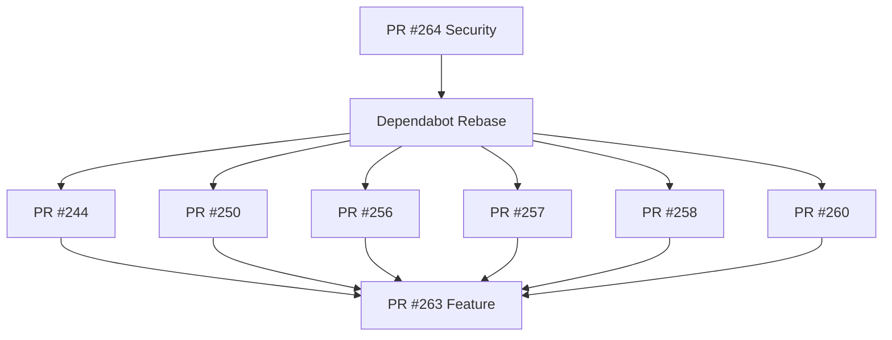

# GOAP Orchestration Plan: All Open PRs

**Created**: 2026-02-06
**Updated**: 2026-02-06 14:30 UTC
**Status**: IN PROGRESS

## Executive Summary

8 open PRs requiring orchestrated merging with dependency management.

## PR Inventory

### Priority 1: Security Foundation (Must merge first)
| PR | Title | Branch | Status | Blocking |
|----|-------|--------|--------|----------|
| #264 | fix(security): update time 0.3.47, bytes 1.11.1 | fix/time-security-update | ⏳ CI Running | All Dependabot PRs |

### Priority 2: Feature PR (Depends on #264)
| PR | Title | Branch | Status | Blocking |
|----|-------|--------|--------|----------|
| #263 | Phase 4 Sprint 1 - Performance | feat/phase4-sprint1-performance | ⏳ CI Running | None |

### Priority 3: Dependabot PRs (Depend on #264 merged to main)
| PR | Title | Branch | Labels | Status |
|----|-------|--------|--------|--------|
| #260 | bump wasmtime-wasi 40→41 | dependabot/cargo/wasmtime-wasi-41.0.1 | rust, security | Awaiting rebase |
| #258 | bump upload-artifact 4→6 | dependabot/github_actions/actions/upload-artifact-6 | github-actions | Awaiting rebase |
| #257 | bump setup-python 5→6 | dependabot/github_actions/actions/setup-python-6 | github-actions | Awaiting rebase |
| #256 | bump action-actionlint 1.69→1.70 | dependabot/github_actions/reviewdog/action-actionlint-1.70.0 | github-actions | Awaiting rebase |
| #250 | bump sysinfo 0.37→0.38 | dependabot/cargo/sysinfo-0.38.0 | rust, security | Awaiting rebase |
| #244 | bump wait-on-check-action 1.4→1.5 | dependabot/github_actions/lewagon/wait-on-check-action-1.5.0 | github-actions | Awaiting rebase |

## GOAP Task Decomposition

```
GOAL: All PRs merged with green CI
├── T1: Merge PR #264 (Security Fix) ✅ READY
│   ├── Pre: CI passes (all checks green)
│   ├── Action: gh pr merge 264 --squash
│   └── Post: Main branch has security fixes
│
├── T2: Rebase Dependabot PRs (Parallel - after T1)
│   ├── T2.1: @dependabot rebase #260 (wasmtime-wasi)
│   ├── T2.2: @dependabot rebase #258 (upload-artifact)
│   ├── T2.3: @dependabot rebase #257 (setup-python)
│   ├── T2.4: @dependabot rebase #256 (action-actionlint)
│   ├── T2.5: @dependabot rebase #250 (sysinfo)
│   └── T2.6: @dependabot rebase #244 (wait-on-check-action)
│
├── T3: Merge Dependabot PRs (Sequential - after T2)
│   ├── T3.1: Merge #244 (oldest first)
│   ├── T3.2: Merge #250
│   ├── T3.3: Merge #256
│   ├── T3.4: Merge #257
│   ├── T3.5: Merge #258
│   └── T3.6: Merge #260
│
└── T4: Merge PR #263 (Feature) - after T3 or parallel
    ├── Pre: All CI checks pass
    ├── Action: gh pr merge 263 --squash
    └── Post: Phase 4 Sprint 1 complete
```

## Dependency Graph



## Execution Strategy

### Phase 1: Security Fix Merge
```bash
# Wait for CI, then merge
gh pr merge 264 --squash --auto
```

### Phase 2: Trigger Dependabot Rebases
```bash
# Already requested via @dependabot rebase comments
# Dependabot will auto-rebase when main updates
```

### Phase 3: Merge Dependabot PRs
```bash
# After rebases complete and CI passes
gh pr merge 244 --squash
gh pr merge 250 --squash
gh pr merge 256 --squash
gh pr merge 257 --squash
gh pr merge 258 --squash
gh pr merge 260 --squash
```

### Phase 4: Feature PR Merge
```bash
# After dependabot PRs or when CI passes
gh pr merge 263 --squash
```

## Current State Tracking

### Fixes Applied (This Session)
- [x] RUSTSEC-2026-0009: time 0.3.46 → 0.3.47 (DoS)
- [x] RUSTSEC-2026-0007: bytes 1.11.0 → 1.11.1 (integer overflow)
- [x] Flaky sandbox tests: Skip in CI environment
- [x] Clippy unit_arg: Fixed benchmark file
- [x] Coverage workflow: Removed invalid --timeout
- [x] Test isolation: Skip in codespaces

### CI Status Snapshot
| PR | Format | Clippy | Tests | Coverage | Supply Chain |
|----|--------|--------|-------|----------|--------------|
| #264 | ✅ | ⏳ | ⏳ | ✅ | ✅ |
| #263 | ✅ | ⏳ | ⏳ | ⏳ | ✅ |

## Risk Mitigation

| Risk | Probability | Impact | Mitigation |
|------|-------------|--------|------------|
| Merge conflicts after #264 | Medium | Low | Dependabot auto-rebases |
| Flaky tests in CI | Low | Medium | Tests skip in CI |
| Coverage timeout | Low | Low | Shell timeout wraps command |
| Dependabot slow rebase | Low | Low | Manual rebase if needed |

## Commands Reference

```bash
# Check PR status
gh pr checks <number>

# Merge with auto-merge when CI passes
gh pr merge <number> --squash --auto

# Request dependabot rebase
gh pr comment <number> --body "@dependabot rebase"

# View PR
gh pr view <number>
```

## Execution Log

### 2026-02-06 14:29 UTC
- ✅ Enabled auto-merge on PR #264 (security fix)
- ✅ Enabled auto-merge on PR #263 (feature)
- ⏳ CI running on both PRs
- ⏳ Waiting for CI to complete for auto-merge

## Success Criteria

- [ ] PR #264 merged to main (auto-merge enabled ✅)
- [ ] All 6 Dependabot PRs rebased and merged
- [ ] PR #263 merged to main (auto-merge enabled ✅)
- [ ] Zero open PRs remaining
- [ ] Main branch has all security fixes
